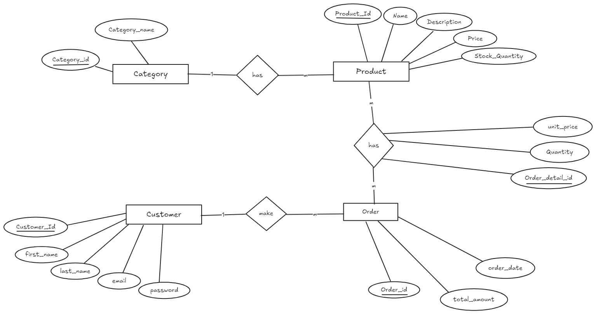
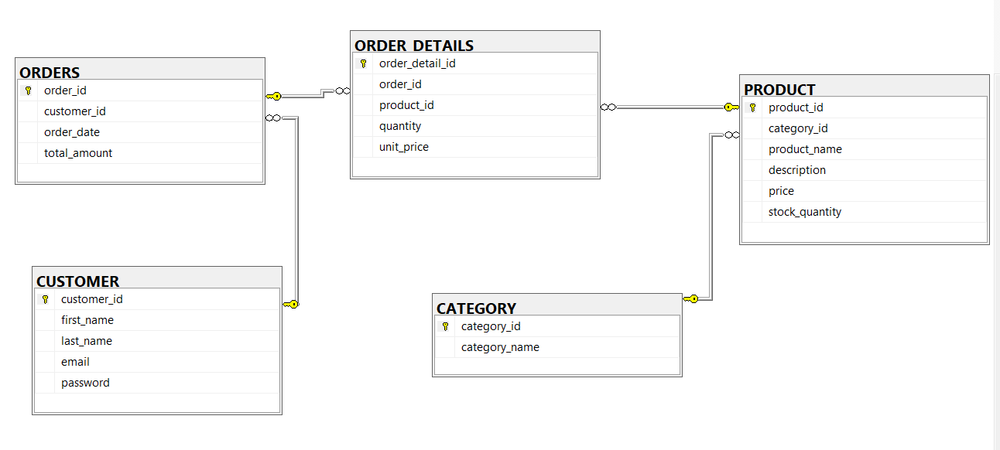

# 🛒 E-Commerce Database Design

## 📑 Table of Contents
- [Overview](#-overview)
- [Setup](#-setup)
- [ER Diagram](#-er-diagram)
- [Reporting Queries](#-reporting-queries)
- [Denormalization](#-Denormalization)
- [Triggers](#-triggers)
- [Functions](#-functions)
- [Permormance Tuning](#-Performance-Tuning)
- [Technologies](#-technologies)

---

## 📌 Overview

This project contains a relational database schema for a simple e-commerce web store, including:

- Product and <u>Category</u> management
- Customer and Orders structure
- Sample data for testing
- Useful reporting queries

---

## ⚙ Setup

1. Install SQL Server (2019 or later) or any compatible RDBMS.
2. Run the [Tables Structure](scripts/schema_scripts/1-tables-structure.md) script to create the database schema.
3. Populate the database with [Sample Data](scripts/schema_scripts/2-sample-data.md).
4. Explore the [Reporting Queries](scripts/reporting_queries) for analytics.
  
---

## 🏗 ER Diagram

 – High-level view of the database structure

 – Detailed schema with relationships and constraints

---

## 📊 Reporting Queries

- [1. Total revenue report](scripts/reporting_queries/1-daily-total-revenue-report.md)
- [2. Top-selling products in a given month](scripts/reporting_queries/2-top-selling-products-monthly-report.md)
- [3. Orders totalling more than $500 in the past month](scripts/reporting_queries/3-customers-with-orders-over-500-last-month.md)
- [4. Products with the word "camera"](scripts/reporting_queries/5-products-contains-word-camera.md)
- [5. Popular products in the same category](scripts/reporting_queries/6-suggest-related-products-same-category-author.md)
- [6. Transaction query to lock field](scripts/reporting_queries/8-transaction-lock-quantity-field.md)
- [7. Transaction query to lock row](scripts/reporting_queries/9-transaction-query-to-lock-row.md)
  
---

## 📊 Denormalization

- [Denormalized table](scripts/reporting_queries/4-denormalization.md)

---

## 🔒 Triggers

- [1. Trigger to create a sale history](scripts/reporting_queries/7-trigger-create-sale-history-on-new-order.md)

---

## 🛠 Functions

- [Function insert 100 category](scripts/schema_scripts/3-function-insert-100-category.md)
- [Function insert 100k products](scripts/schema_scripts/4-function-insert-100k-products.md)
- [Function insert 1M customers](scripts/schema_scripts/5-function-insert-1m-customers.md)
- [Function insert orders and order details](scripts/schema_scripts/6-function-insert-orders-and-order-details.md)
  
---

## 🚀 Performance Tuning

This section contains scripts and strategies to optimize query performance and database health:

- [Case 1 – Retrieve Total Number of Products in Each Category](performance_tuning/docs/case-1-total-products-per-category.md)
- [Case 2 – Find the Top Customers by Total Spending](performance_tuning/docs/case-2-top-spending-customers.md)
- [Case 3 – Retrieve the Most Recent Orders with Customer Info](performance_tuning/docs/case-3-Most-Recent-Orders.md)
- [Case 4 – List Products That Have Low Stock Quantities](performance_tuning/docs/case-4-Low-Stock-Quantities.md)
- [Case 5 – revenue by category](performance_tuning/docs/case-5-revenue-by-category.md)

---

## 👨‍💻 Technologies

- SQL Server (2019 or later)
- SQL
- Tools: SQL Server Management Studio (SSMS)
