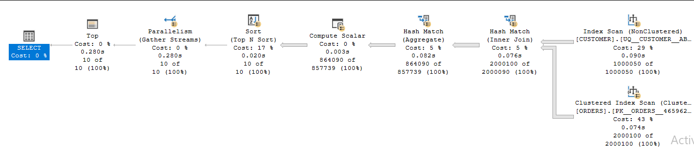

# 📊 Case 2 – Find the Top Customers by Total Spending

## 📌 Problem Statement
We wanted to identify the customers with the highest overall spending.  
The query had to aggregate each customer's orders and rank them by total amount spent.

---

## 📝 Query

```sql
SELECT TOP 10  
       c.customer_id AS [Customer ID],  
       SUM(o.total_amount) AS [Total Spending]
FROM customer c
JOIN orders o 
    ON c.customer_id = o.customer_id
GROUP BY c.customer_id
ORDER BY [Total Spending] DESC;
````

---

## ⏱️ Before Optimization

**Query Stats:**

- **ORDERS Table**
    
    - Logical Reads: 6,041
        
- **CUSTOMER Table**
    
    - Logical Reads: 4,270
        
- **Execution Time**
    
    - CPU Time: 940 ms
        
    - Elapsed Time: 324 ms
        

---
## 📊 Execution Plan (Before)



---

## 🔧 Optimization Applied

- Added an index on `orders(customer_id)` including `total_amount`:
    

```sql
CREATE INDEX IX_Orders_CustomerID
ON orders (customer_id)
INCLUDE (total_amount);
```

---

## 🚀 After Optimization

**Query Stats:**

- **ORDERS Table**
    
    - Logical Reads: 4,539 (+25%)
        
- **CUSTOMER Table**
    
    - Logical Reads: 4,270 (no change)
        
- **Execution Time**
    
    - CPU Time: 704 ms (+25%)
        
    - Elapsed Time: 265 ms (+18%)
        

---

## 📊 Execution Plan (after)


---

## 📈 Comparison Table

|Metric|Before Index|After Index|Improvement|
|---|--:|--:|--:|
|ORDERS Logical Reads|6,041|4,539|**+25%**|
|CUSTOMER Logical Reads|4,270|4,270|0%|
|CPU Time (ms)|940|704|**+25%**|
|Elapsed Time (ms)|324|265|**+18%**|

---

## 💡 What I Learned

- ✅ **Indexing reduced reads** on `orders` and improved performance (Logical Reads +25%).
    
- ✅ **Execution time improved** from 324 ms → 265 ms (~18%).
    
- ℹ️ Improvement wasn’t as dramatic as Case 1 because:
    
    - `customer_id` is already indexed in the `customer` table (Primary Key).
        
    - Query does heavy aggregation, so some reads are unavoidable.

---
