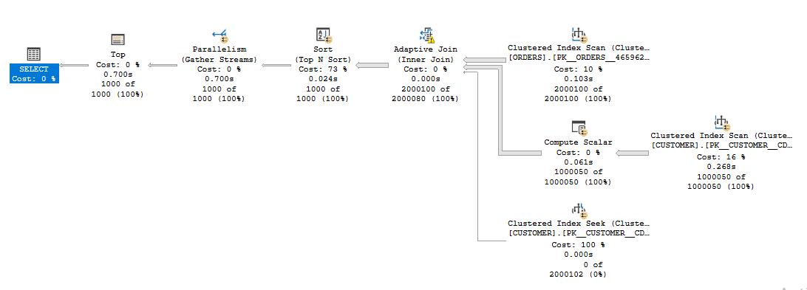
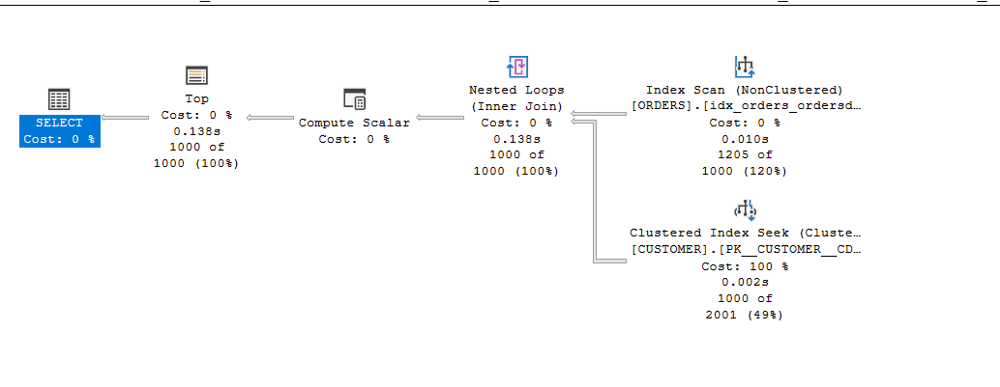

# 📊 Case 3 – Retrieve the Most Recent Orders with Customer Info

## 📌 Problem Statement
We needed to retrieve the **most recent 1000 orders** along with customer details.  
The query was performing a full scan on large tables and sorting on `order_date`, which caused **high logical reads** and **slow performance**.

```sql
SELECT TOP 1000
       o.order_id AS [Order ID],
       c.customer_id AS [Customer ID],
       c.first_name + ' ' + c.last_name AS [Customer Name],
       c.email
FROM customer c
JOIN orders o
    ON c.customer_id = o.customer_id
ORDER BY o.order_date DESC;
```

---

## ⏱️ Before Optimization

**Query Stats:**

* **ORDERS Table**
  * Logical Reads: 6,041
* **CUSTOMER Table**
  * Logical Reads: 10,551
* **Execution Time**
  * **CPU time:** 1,283 ms
  * **Elapsed time:** 839 ms

---

## 📊 Execution Plan (Before)




---

## 🔧 Optimization Applied

✅ Since the query sorts on `order_date`, we created a **covering index** on that column,  
and **included `order_id` and `customer_id`** so SQL Server can get all required values **directly from the index**.

```sql
CREATE INDEX IX_Orders_OrderDate
ON orders (order_date DESC)
INCLUDE (order_id, customer_id);
```

---

## 🚀 After Optimization

**Query Stats:**

* **ORDERS Table**
  * Logical Reads: 8 (↓ from 6,041)
* **CUSTOMER Table**
  * Logical Reads: 5,414 (↓ from 10,551)
* **Execution Time**
  * **CPU time:** 0 ms
  * **Elapsed time:** 256 ms

---

## 📊 Execution Plan (after)



---
## 📈 Comparison Table

| Metric                 | Before Index | After Index | Improvement   |
| ---------------------- | -----------: | ----------: | ------------: |
| ORDERS Logical Reads   |        6,041 |          8  |   **-99%** 🚀 |
| CUSTOMER Logical Reads |       10,551 |      5,414  |   **-49%**    |
| CPU Time (ms)          |        1,283 |          0  |   **-100%**   |
| Elapsed Time (ms)      |          839 |        256  |   **-69%**    |

---

## 💡 What I Learned

* ✅ A **covering index** on `order_date` made the query **blazing fast**.
* ✅ **Logical reads dropped by more than 99%** on `orders`.
* ✅ No **sort operation** is needed anymore — SQL Server reads data **already ordered**.
* 📌 Including `order_id` and `customer_id` eliminated **Key Lookups**.

---

✅ This case shows how a **well-designed covering index** can turn a slow, scan-heavy query into an **instant lookup** query.

