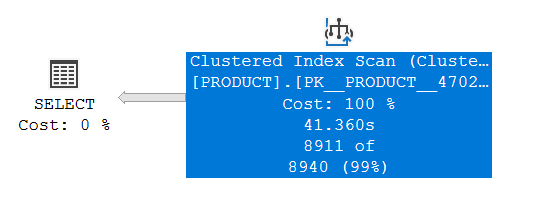
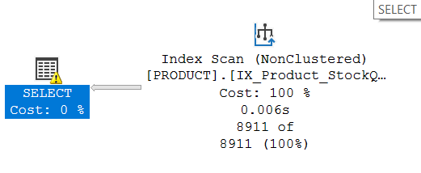

# 📊 Case 4 – List Products That Have Low Stock Quantities

## 📌 Problem Statement
We needed to retrieve **products with low stock (less than 10 units)**.  
The table was large, and the query was **scanning the entire table** to filter rows.

```sql
SELECT product_id AS [product id], 
       product_name AS [product_name], 
       stock_quantity AS [stock quantity]
FROM product
WHERE stock_quantity < 10;
```

---

## ⏱️ Before Optimization

**Query Stats:**

* **PRODUCT Table**
  * Logical Reads: 4,860
  * Physical Reads: 4,653
* **Execution Time**
  * **CPU time:** 156 ms
  * **Elapsed time:** 41,395 ms ❌ (very slow)

---

## 📊 Execution Plan (Before)



---
## 🔧 Optimization Applied

✅ **Created a Filtered Index:**

```sql
CREATE INDEX IX_Product_StockQuantity_Low
ON product (stock_quantity)
INCLUDE (product_name)
WHERE stock_quantity < 10;
```

📌 **Why Filtered Index?**
* Only stores **products with stock < 10** → much smaller index.
* Makes this query **super fast** since only a small subset of rows is scanned.

---

## 🚀 After Optimization

**Query Stats:**

* **PRODUCT Table**
  * Logical Reads: 39 (⬇ from 4,860)
  * Physical Reads: 0 (⬇ from 4,653)
* **Execution Time**
  * **CPU time:** 0 ms
  * **Elapsed time:** 241 ms ✅

---

## 📊 Execution Plan (after)




---

## 📈 Comparison Table

| Metric           | Before   | After   | Improvement |
| ---------------- | -------: | ------: | ----------: |
| Logical Reads    | 4,860    | 39      | **-99%**    |
| Physical Reads   | 4,653    | 0       | **-100%**   |
| CPU Time (ms)    | 156      | 0       | **-100%**   |
| Elapsed Time (ms)| 41,395   | 241     | **-99.4%**  |

---

## 💡 What I Learned

* ✅ **Filtered indexes** are perfect for **queries targeting a small subset** of rows.
* ✅ Reduced **IO cost** drastically (from thousands of reads to under 50).
* ✅ **Query execution went from 41 seconds → under a second!**
* 🔜 In future, similar **targeted queries** can also benefit from filtered indexes.
