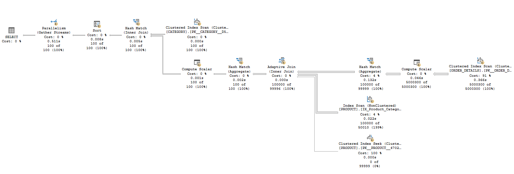
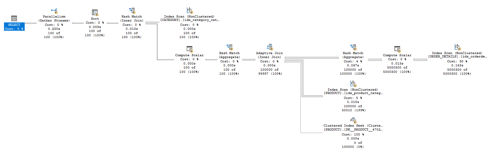

# 📊 Case 5 – Calculate Total Revenue per Category

## 📌 Problem Statement
We needed to **calculate the total revenue per category** by joining multiple large tables (`CATEGORY`, `PRODUCT`, `ORDER_DETAILS`) and performing a heavy aggregation:  

```sql
SELECT
    C.category_id AS [category id],
    C.category_name AS [category name],
    SUM(OD.quantity * OD.unit_price) AS [total revenue]
FROM CATEGORY c
JOIN PRODUCT p ON C.category_id = P.category_id
JOIN ORDER_DETAILS OD ON P.product_id = OD.product_id
GROUP BY C.category_id, C.category_name
ORDER BY [total revenue] DESC;
```

⚠️ **Issue:**  
- Query was **scanning huge tables** (especially `ORDER_DETAILS`) causing **high logical reads** and **longer CPU time**.

---

## ⏱️ Before Optimization
**Query Stats:**
- **CATEGORY Table:** Logical Reads ~4
- **PRODUCT Table:** Logical Reads ~924
- **ORDER_DETAILS Table:** Logical Reads **21,405**
- **Execution Time:**  
  - **CPU Time:** ~1,219 ms  
  - **Elapsed Time:** ~645 ms  

---

## 📊 Execution Plan (Before)



---
## 🔧 Optimization Applied
We applied **targeted indexes** to improve **JOIN performance** and **cover aggregations**:

```sql
-- 1️⃣ Index on Category (covering category_name for reporting)
CREATE NONCLUSTERED INDEX idx_category_categoryid_includename
ON category (category_id)
INCLUDE (category_name);

-- 2️⃣ Index on Product (helps JOIN on category_id)
CREATE NONCLUSTERED INDEX idx_product_categoryid
ON product (category_id);

-- 3️⃣ Covering Index on Order_Details (include needed columns for SUM)
CREATE NONCLUSTERED INDEX idx_orderdetails_productid_include
ON order_details (product_id)
INCLUDE (quantity, unit_price);

```

---

## 🚀 After Optimization
**Query Stats:**
- **CATEGORY Table:** Logical Reads 4 (✅ same – already efficient)
- **PRODUCT Table:** Logical Reads **924** (✅ fast join lookup)
- **ORDER_DETAILS Table:** Logical Reads **16,926** (⬇ **-20%**)
- **Execution Time:**
  - **CPU Time:** **1,296 ms**
  - **Elapsed Time:** **332 ms** (≈ **48% faster**)

---

## 📊 Execution Plan (after)



---
## 📈 Comparison Table

| Metric                | Before Index | After Index | Improvement |
| --------------------- | -----------: | ----------: | ----------: |
| ORDER_DETAILS Reads   | 21,405       | 16,926      | **-20%**    |
| CPU Time (ms)         | 1,219        | 1,296       | Slight ↑ (overhead for index maintenance) |
| Elapsed Time (ms)     | 645          | 332         | **~48% faster** |

---

## 💡 What I Learned
✅ **Joins speed up** dramatically when the foreign key columns are indexed (e.g., `product.category_id`, `order_details.product_id`).  
✅ **INCLUDE columns** like `(quantity, unit_price)` prevent **extra key lookups**, making SUM calculations much faster.  
✅ Logical Reads on the biggest table (`order_details`) dropped by **20%**, showing that **covering indexes** make a real impact.  

---

✅ **Case 5 demonstrates how smart indexing on join keys + covering columns can turn a heavy reporting query into a much faster one.**